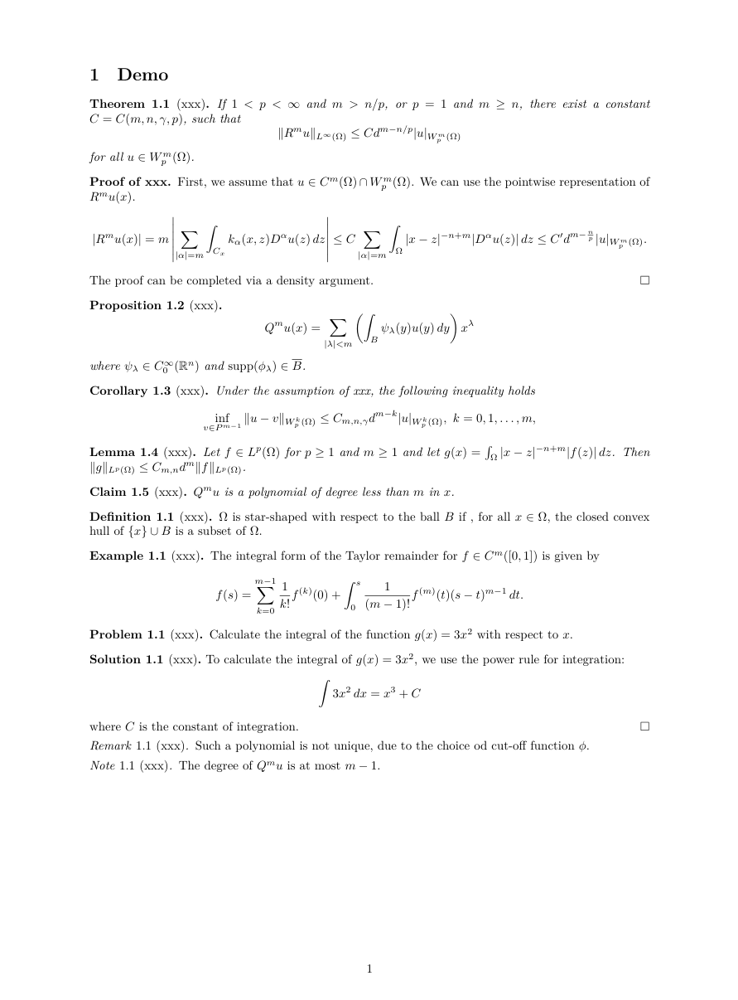
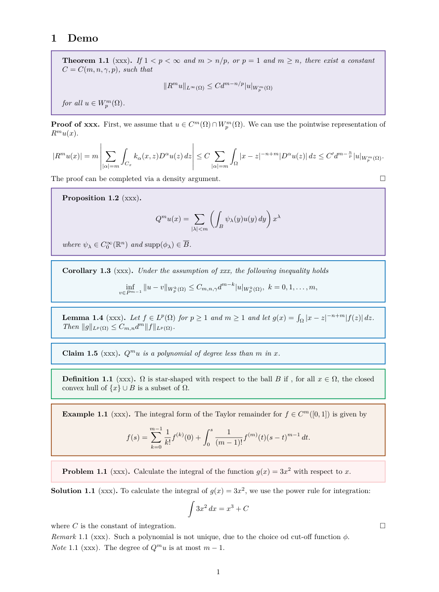
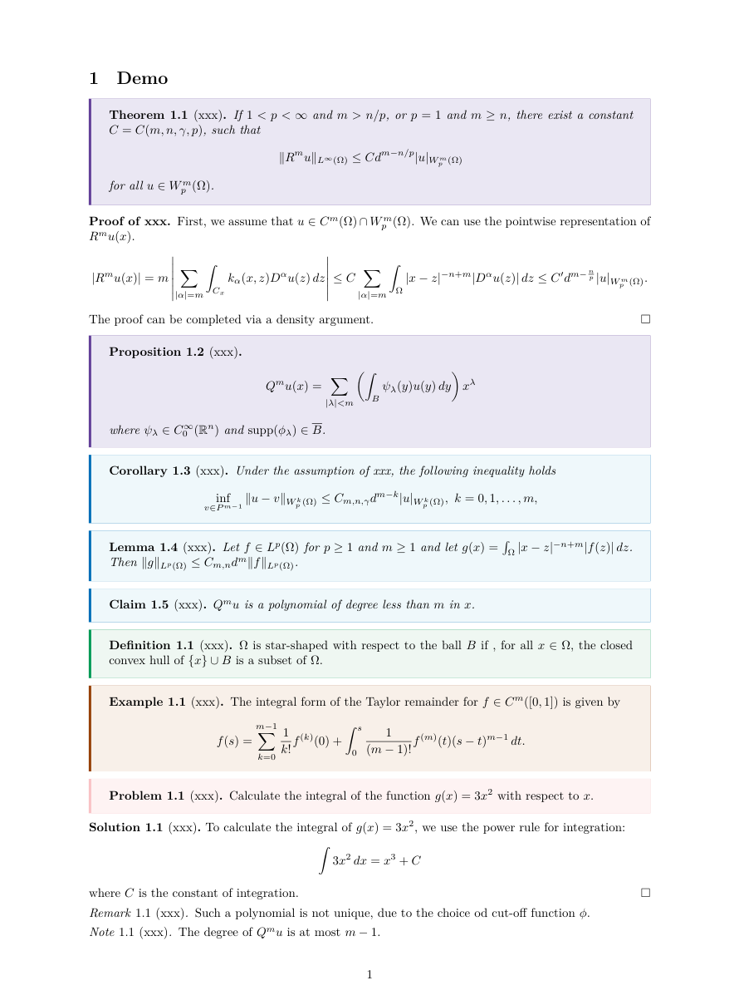
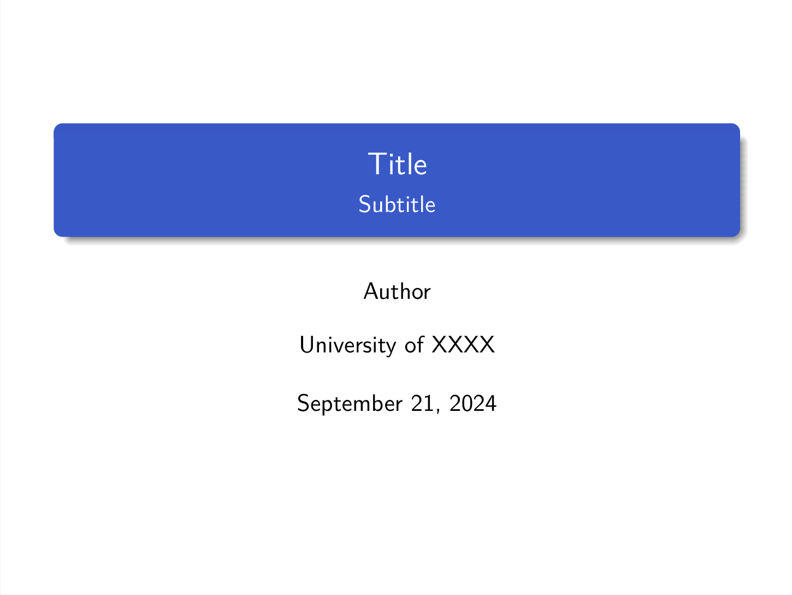
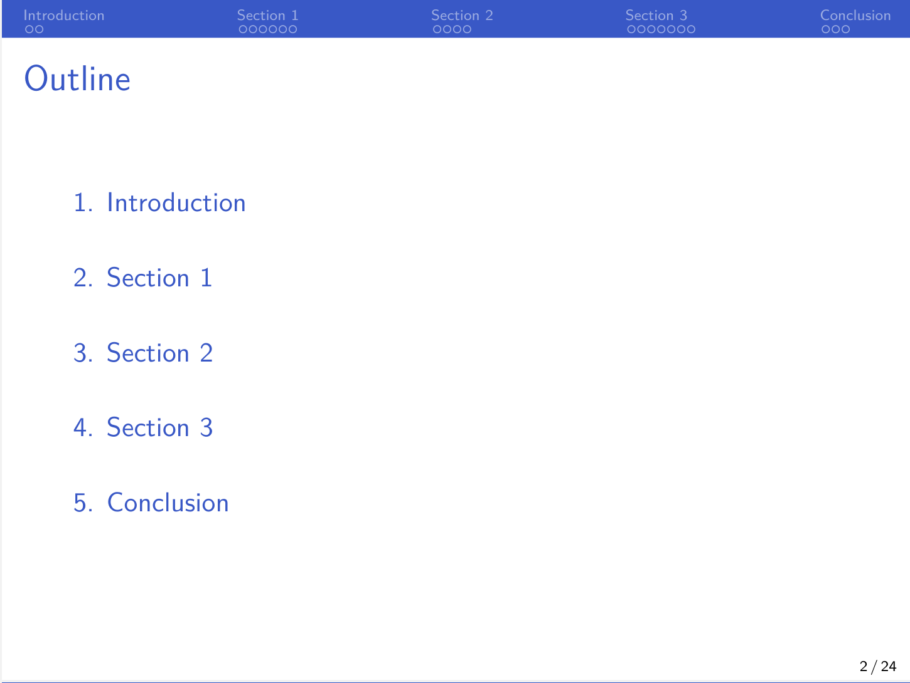
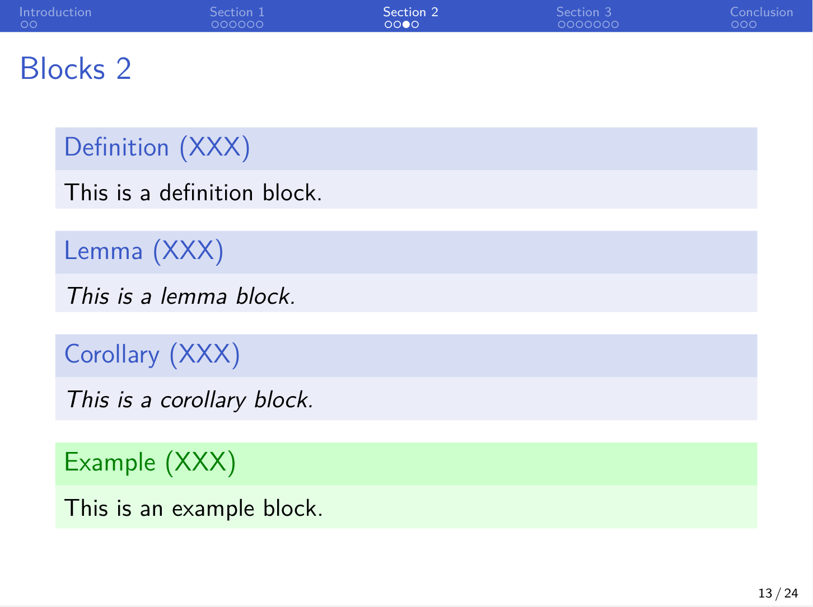
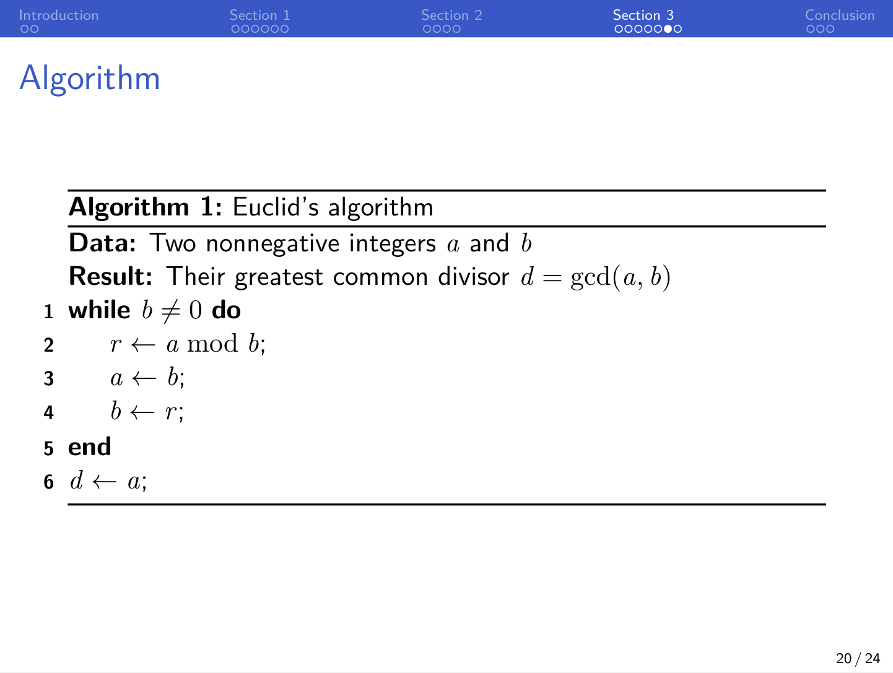

# LaTeX Templates for Mathematical Notes

Simple LaTeX templates designed for mathematical notes.

## Note

Styles:

- `note-setup` = `note-setup-box`
- `note-setup-simple`
- `note-setup-box` (tcolorbox)
- `note-setup-leftsidebox` (tcolorbox)
- `note-setup-mframed` (mframed, legacy)

**note-setup-simple**



**note-setup-box**



**note-setup-leftsidebox**




Environments:

| Environment                   | Style           | Numbering Rule              |
| ----------------------------- | --------------- | --------------------------- |
| `theorem`, `theorem*`         | plain           | within section              |
| `proposition`, `proposition*` | plain           | shares counter with theorem |
| `corollary`, `corollary*`     | plain           | shares counter with theorem |
| `lemma`, `lemma*`             | plain           | shares counter with theorem |
| `claim`, `claim*`             | plain           | shares counter with theorem |
| `definition`, `definition*`   | definition      | within section              |
| `example`, `example*`         | definition      | within section              |
| `problem`, `problem*`         | definition      | within section              |
| `remark`, `remark*`           | remark          | within section              |
| `note`, `note*`               | remark          | within section              |
| `solution`, `solution*`       | (solutionstyle) | within section              |


Usage:
```latex
\documentclass{article}
\input{/path/to/note-setup}

...
```


## Beamer

<p align="center">
    
</p>

<p align="center">
    
</p>

<p align="center">
    
</p>

<p align="center">
    
</p>


Usage:
```latex
\documentclass[compress,aspectratio=43]{beamer}
\input{/path/to/beamer-setup}

...
```
