# LaTeX Templates for Mathematical Notes

English | [简体中文](./README.zh-CN.md)

Simple LaTeX templates for mathematical notes and Beamer slides.

> ⚠️ **Note template compatibility:** The Note templates now use `keytheorems`
> instead of `thmtools` to avoid the shared-counter incompatibility in TeX Live
> 2026 described in
> [thmtools issue #75](https://github.com/muzimuzhi/thmtools/issues/75). The
> previous `thmtools`-based Note templates, including the `mdframed` style, are
> retained on the
> [`legacy/thmtools` branch](https://github.com/fenglielie/latexzero/tree/legacy/thmtools)
> for TeX Live 2025 and earlier.

## ✨ Overview

- Templates for mathematical notes and Beamer slides
- Multiple note and presentation styles with preview images
- Suitable for Overleaf and local TeX Live workflows

## 📚 Table of Contents

- [LaTeX Templates for Mathematical Notes](#latex-templates-for-mathematical-notes)
  - [✨ Overview](#-overview)
  - [📚 Table of Contents](#-table-of-contents)
  - [🚀 How to use it?](#-how-to-use-it)
  - [📝 Note](#-note)
    - [🎨 Available styles](#-available-styles)
    - [🧩 Supported environments](#-supported-environments)
    - [🔧 Usage](#-usage)
    - [🌄 Cover page](#-cover-page)
  - [📊 Beamer](#-beamer)
    - [🎨 Available styles](#-available-styles-1)
    - [🔧 Usage](#-usage-1)

## 🚀 How to use it?

1. Clone or download this repository, or download the file(s) you need, such as [note-setup.tex](./note/note-setup.tex).

2. Input the setup file in the preamble of your document.

Usage example:
```latex
\documentclass{article}
\input{./note-setup}

\title{Title}
\author{Author}
\date{\today}

\begin{document}

\maketitle

\end{document}
```

For local builds, English-only note and Beamer documents can be compiled with `pdflatex`, `xelatex`, or `lualatex`; for CJK or mixed-language documents, `xelatex` or `lualatex` is recommended.

> ✨ **New:** The Note templates can be used either by inputting an individual
> setup file or through the unified [sty package](./note-sty/README.md), which supports switching styles via package options.

## 📝 Note

### 🎨 Available styles

All note styles share the same commands and environments, so you can switch between them directly by changing the setup file.

- [`note-setup`](./note/note-setup.tex): the default style, with colored borders and lightly tinted backgrounds.
- [`note-setup-attached`](./note/note-setup-attached.tex): derived from `note-setup`, with attached title labels.
- [`note-setup-leftbar`](./note/note-setup-leftbar.tex): uses colored left bars and lightly tinted backgrounds.
- [`note-setup-shaded`](./note/note-setup-shaded.tex): uses borderless boxes with lightly tinted backgrounds.
- [`note-setup-plain`](./note/note-setup-plain.tex): uses the standard theorem layout without depending on tcolorbox.
- [`note-setup-dark`](./note/note-setup-dark.tex): uses a dark page and dark theorem boxes; experimental.

**note-setup**

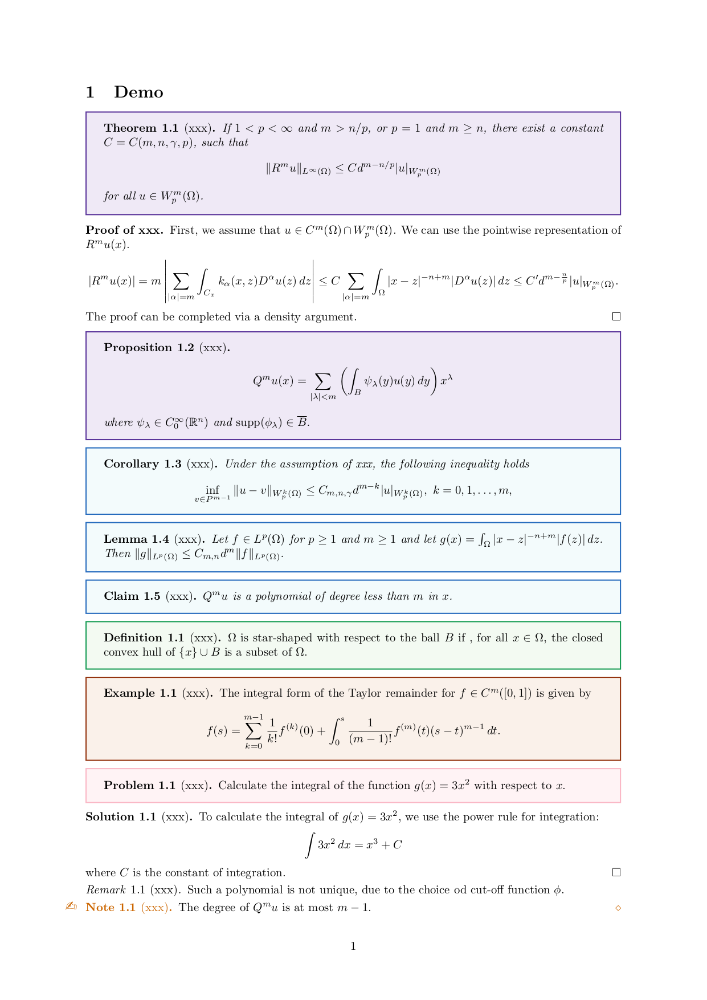

**note-setup-attached**

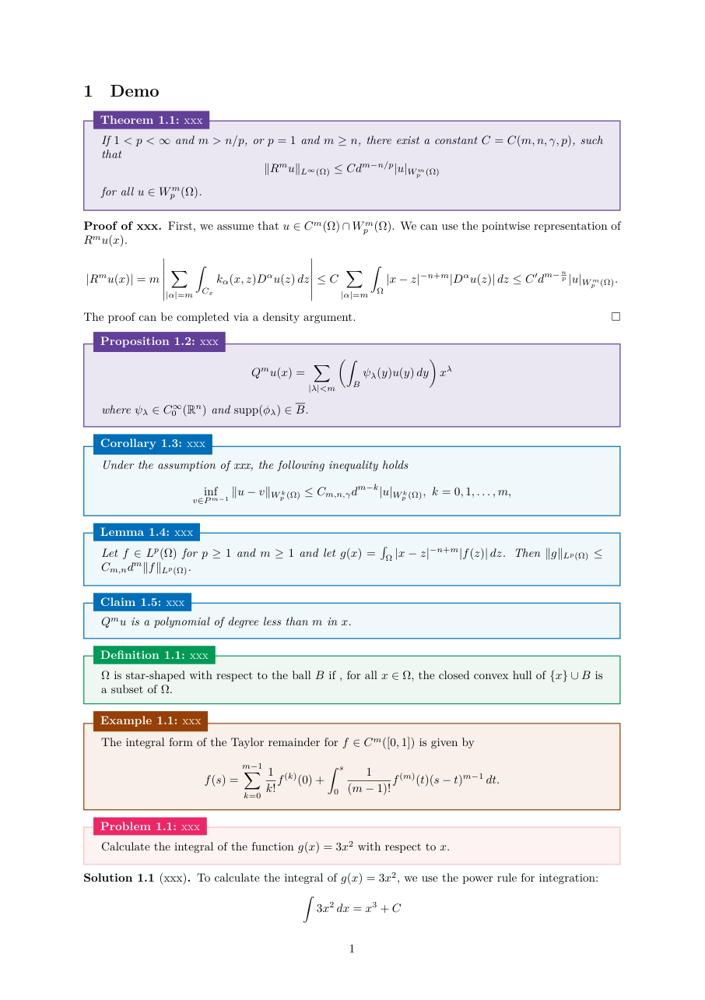

**note-setup-leftbar**

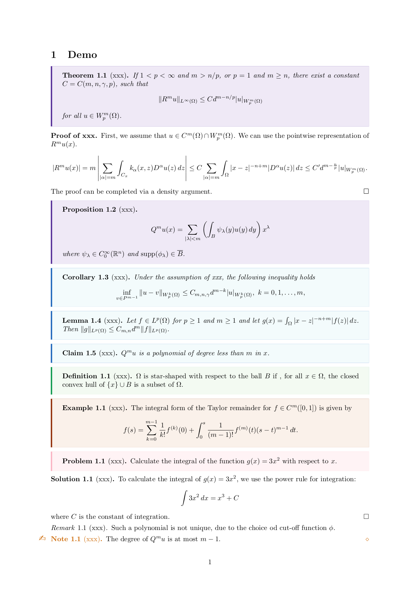

**note-setup-shaded**

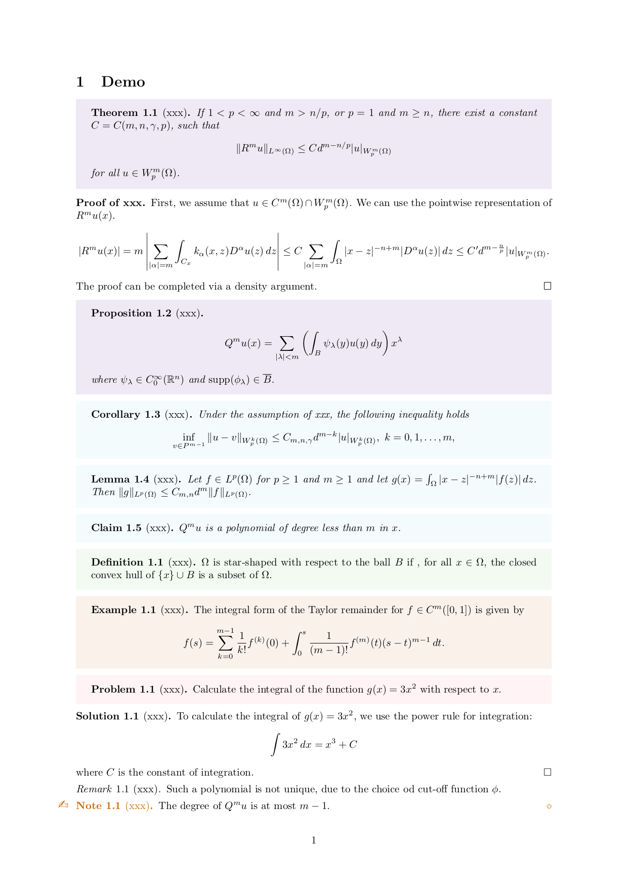

**note-setup-plain**

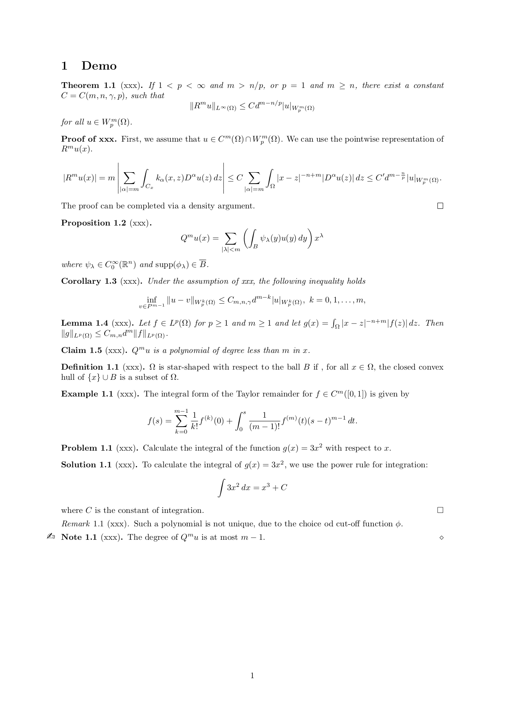

**note-setup-dark**

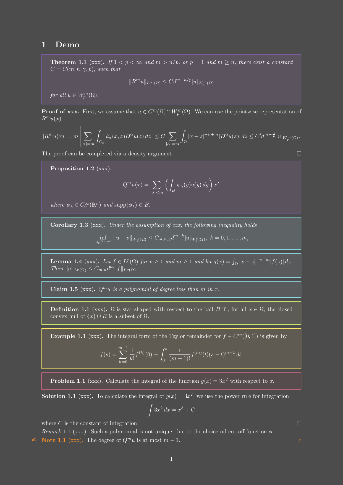

### 🧩 Supported environments

| Environment                   | Style           | Numbering Rule              |
| ----------------------------- | --------------- | --------------------------- |
| `theorem`, `theorem*`         | plain           | within section              |
| `proposition`, `proposition*` | plain           | shares counter with theorem |
| `corollary`, `corollary*`     | plain           | shares counter with theorem |
| `lemma`, `lemma*`             | plain           | shares counter with theorem |
| `claim`, `claim*`             | plain           | shares counter with theorem |
| `definition`, `definition*`   | definition      | within section              |
| `example`, `example*`         | definition      | within section              |
| `problem`, `problem*`         | definition      | within section              |
| `remark`, `remark*`           | remark          | within section              |
| `note`, `note*`               | remark          | within section              |
| `solution`, `solution*`       | (solutionstyle) | within section              |


### 🔧 Usage
```latex
\documentclass{article}
\input{/path/to/note-setup}

...
```

### 🌄 Cover page

To add a cover page, use `\makecover`.

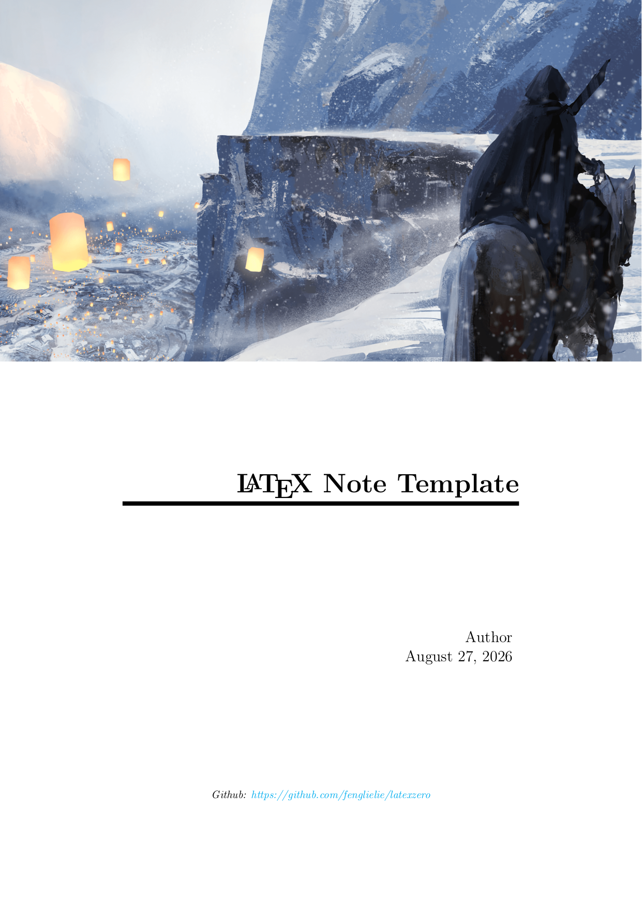


## 📊 Beamer

### 🎨 Available styles

All Beamer styles share the same commands and structure, so you can switch between them directly by changing the setup file.

- [`beamer-setup`](./beamer/beamer-setup.tex): the default style, with a top navigation bar and rounded title page.
- [`beamer-setup-minimal`](./beamer/beamer-setup-minimal.tex): removes the navigation bar and uses a cleaner title page.
- [`beamer-setup-console`](./beamer/beamer-setup-console.tex): a dark, terminal style inspired by [kmbeamer](https://github.com/kmaed/kmbeamer).

**beamer-setup**

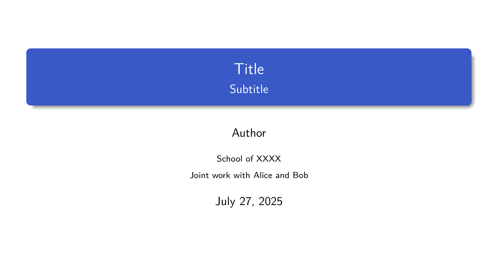

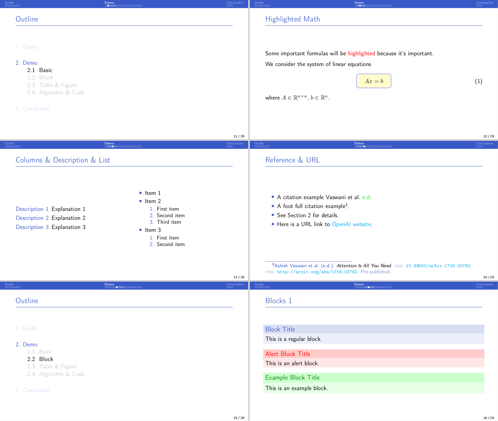

**beamer-setup-minimal**

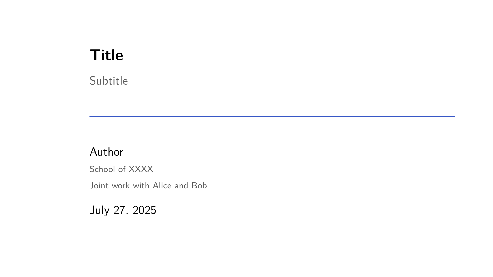

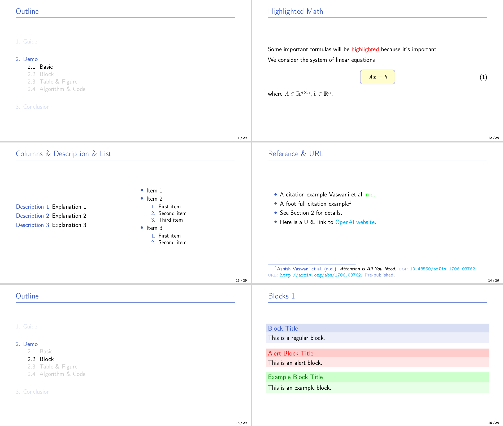

**beamer-setup-console**

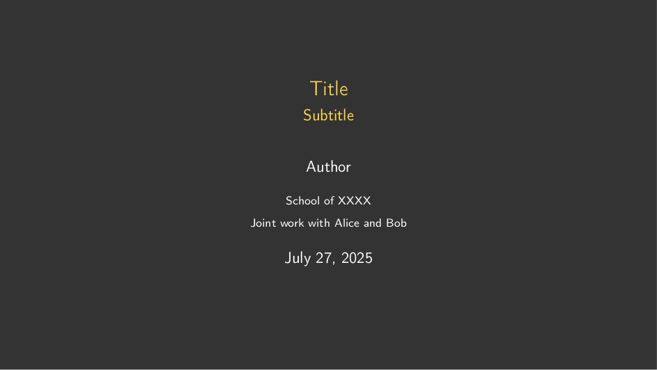

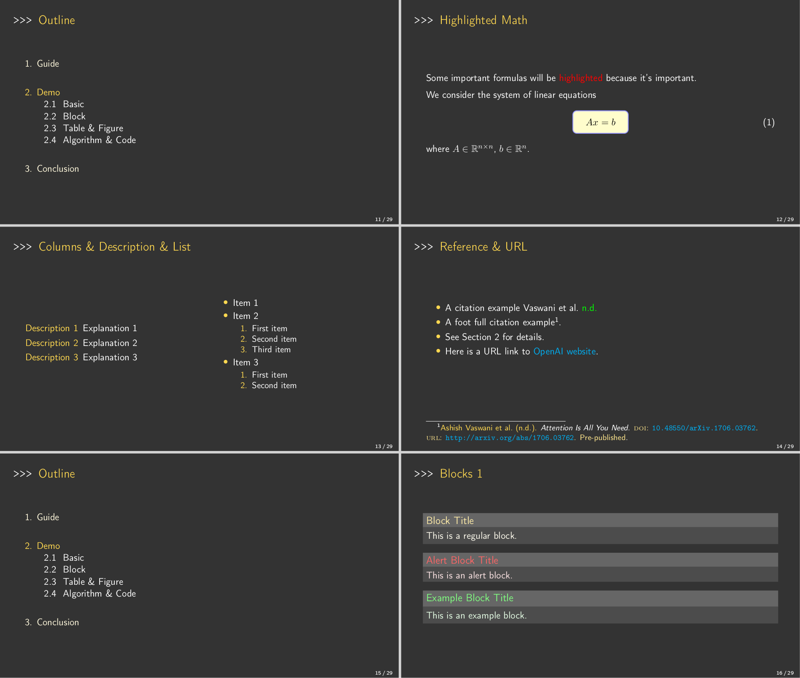

### 🔧 Usage
```latex
\documentclass[compress,aspectratio=169]{beamer}
% \definecolor{simplebeamercolor}{RGB}{200,50,50}% define before \input to customize theme color
\input{/path/to/beamer-setup}

...
```
