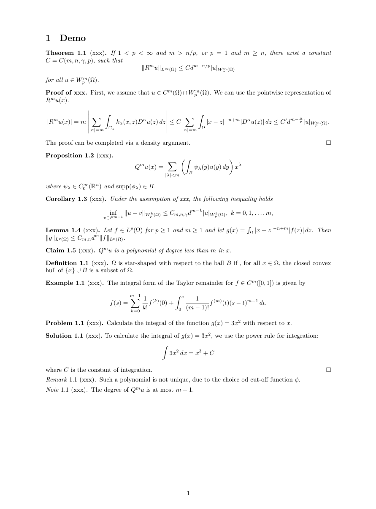
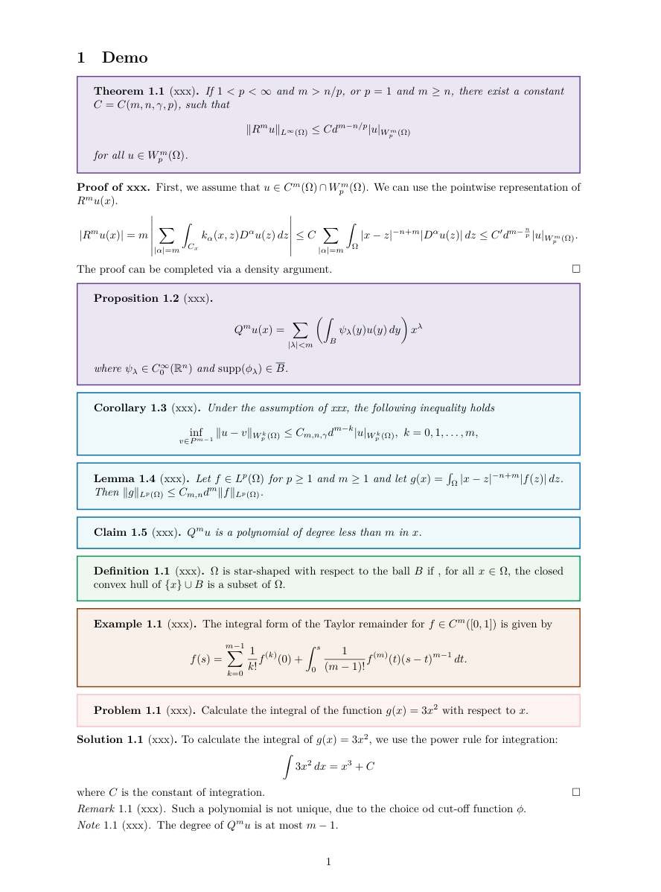
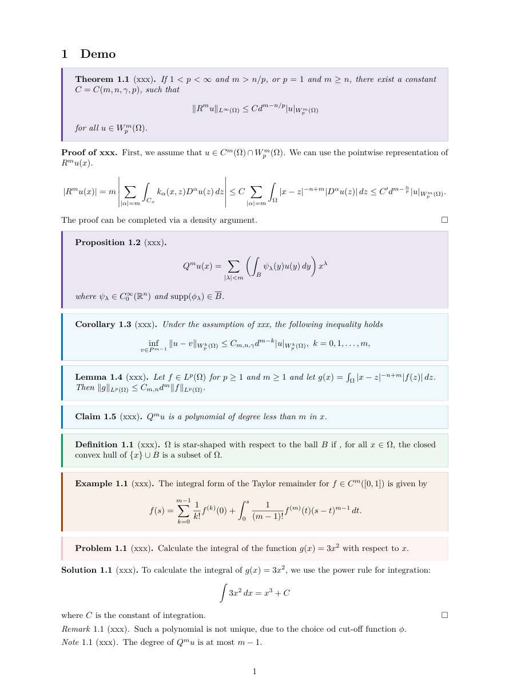
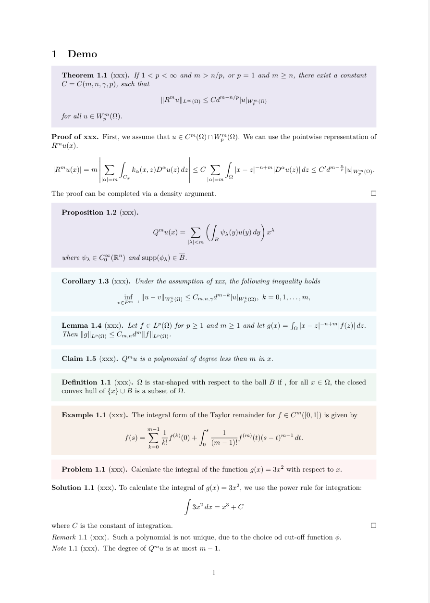
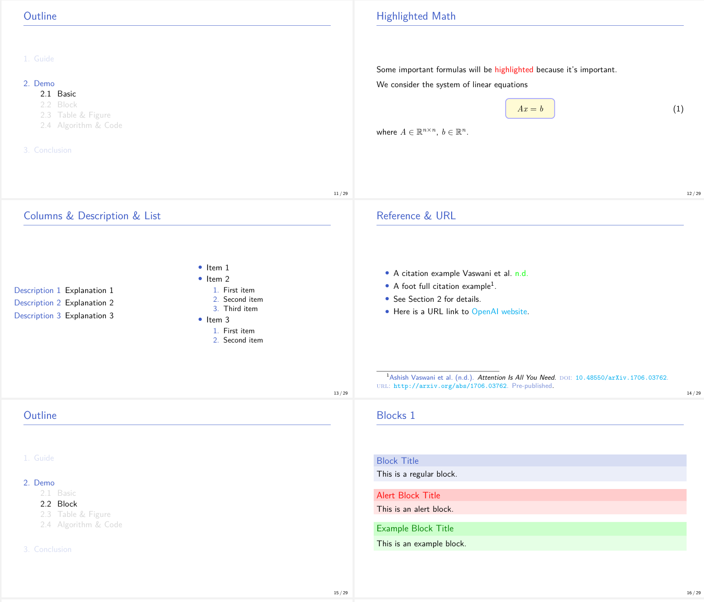
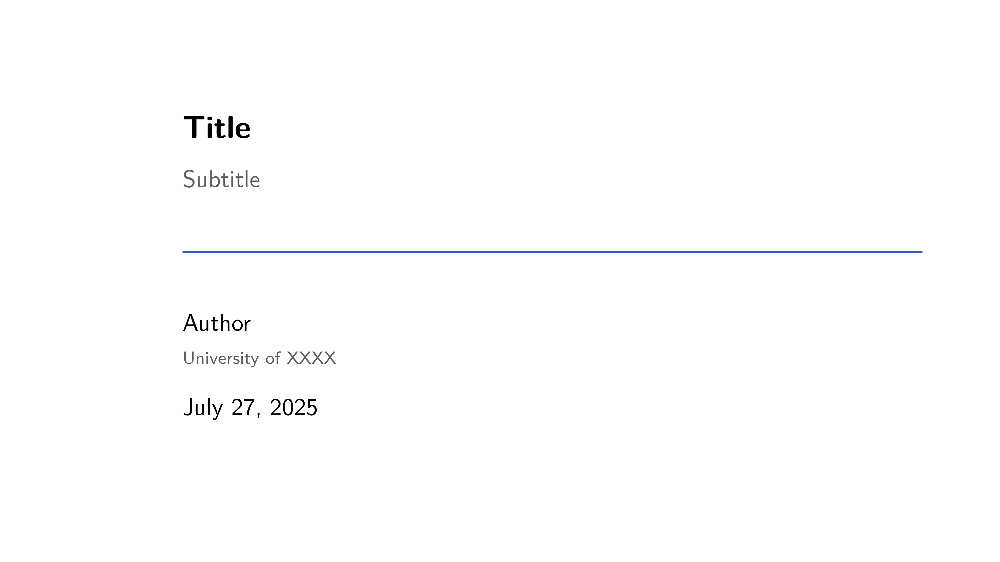

# LaTeX Templates for Mathematical Notes

English | [简体中文](./README.zh-CN.md)

Simple LaTeX templates for mathematical notes and Beamer slides.

> **Note template compatibility:** The Note templates now use `keytheorems`
> instead of `thmtools` to avoid the shared-counter incompatibility in TeX Live
> 2026 described in
> [thmtools issue #75](https://github.com/muzimuzhi/thmtools/issues/75). The
> previous `thmtools`-based Note templates, including the `mdframed` style, are
> retained on the
> [`legacy/thmtools` branch](https://github.com/fenglielie/latexzero/tree/legacy/thmtools)
> for TeX Live 2025 and earlier.

## Overview

- Templates for mathematical notes and Beamer slides
- Multiple note and presentation styles with preview images
- Suitable for Overleaf and local TeX Live workflows

## Table of Contents

- [How to use it?](#how-to-use-it)
- [Note](#note)
- [Beamer](#beamer)
- [More](#more)

## How to use it?

1. Clone or download this repository, or simply download the file(s) you need, such as [note-setup.tex](./note/note-setup.tex).

2. Input the setup file in the preamble of your document.

Usage example:
```latex
\documentclass{article}
\input{./note-setup}

\title{Title}
\author{Author}
\date{\today}

\begin{document}

\maketitle

\end{document}
```

For local builds, English-only note and Beamer documents can be compiled with `pdflatex`, `xelatex`, or `lualatex`; for CJK or mixed-language documents, `xelatex` or `lualatex` is recommended.

## Note

### Available styles

All note styles share the same commands and environments, so you can switch between them directly by changing the setup file.

- `note-setup` = `note-setup-box`
- `note-setup-simple`
- `note-setup-box` (tcolorbox)
- `note-setup-leftsidebox` (tcolorbox)
- `note-setup-borderless` (tcolorbox)
- `note-setup-dark` (tcolorbox, experimental; may have issues in practical use)

**note-setup-simple**



**note-setup-box**



**note-setup-leftsidebox**



**note-setup-borderless**



**note-setup-dark**


### Supported environments

| Environment                   | Style           | Numbering Rule              |
| ----------------------------- | --------------- | --------------------------- |
| `theorem`, `theorem*`         | plain           | within section              |
| `proposition`, `proposition*` | plain           | shares counter with theorem |
| `corollary`, `corollary*`     | plain           | shares counter with theorem |
| `lemma`, `lemma*`             | plain           | shares counter with theorem |
| `claim`, `claim*`             | plain           | shares counter with theorem |
| `definition`, `definition*`   | definition      | within section              |
| `example`, `example*`         | definition      | within section              |
| `problem`, `problem*`         | definition      | within section              |
| `remark`, `remark*`           | remark          | within section              |
| `note`, `note*`               | remark          | within section              |
| `solution`, `solution*`       | (solutionstyle) | within section              |


### Usage
```latex
\documentclass{article}
\input{/path/to/note-setup}

...
```

### Cover page

To add a cover page, use `\makecover`.


## Beamer

### Available styles

All Beamer styles share the same commands and structure, so you can switch between them directly by changing the setup file.

- `beamer-setup`
- `beamer-setup-plain`
- `beamer-setup-simple` (derived from `beamer-setup-plain`, with a simpler title page)
- `beamer-setup-console` (inspired by [kmbeamer](https://github.com/kmaed/kmbeamer))

**beamer-setup**


**beamer-setup-plain**



**beamer-setup-simple**

Derived from `beamer-setup-plain`, with a simpler left-aligned title page and a horizontal rule.




**beamer-setup-console**


### Usage
```latex
\documentclass[compress,aspectratio=169]{beamer}
% \definecolor{simplebeamercolor}{RGB}{200,50,50}% define before \input to customize theme color
\input{/path/to/beamer-setup}

...
```

## More

- The repository also includes a `lab-report` template under [`lab-report/`](./lab-report/).
- The repository also includes a usable VS Code LaTeX Workshop configuration in [`.vscode/settings.json`](./.vscode/settings.json).
