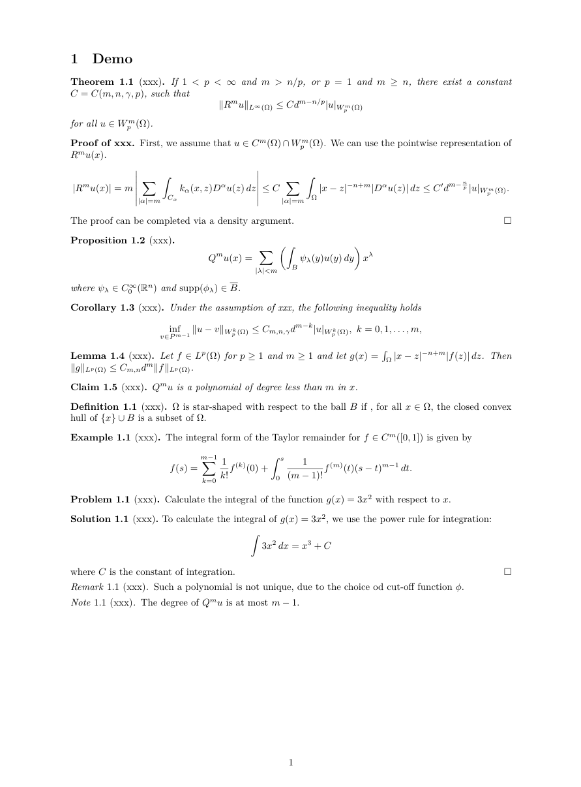
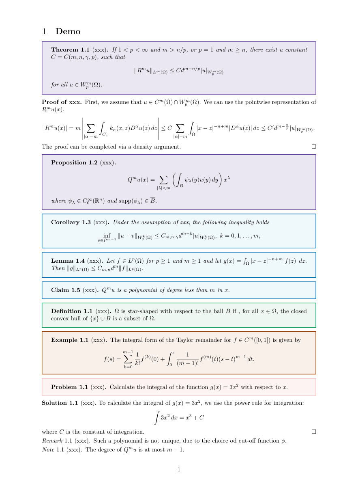
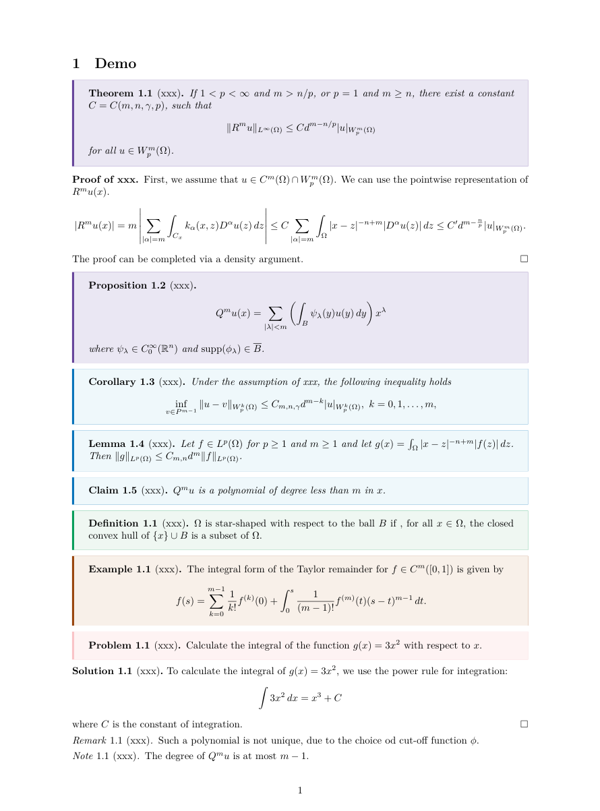
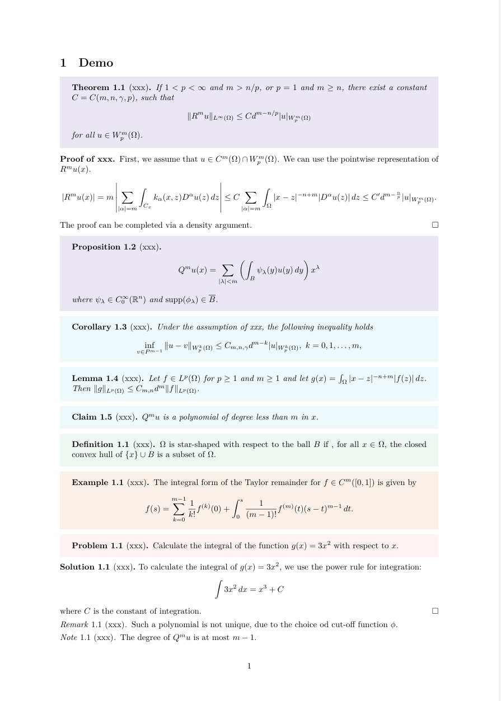
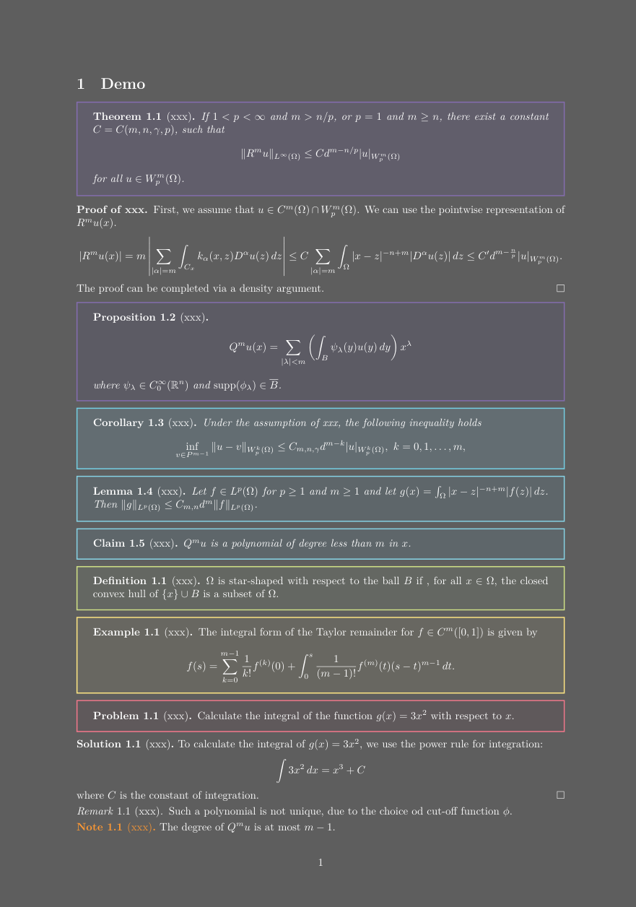
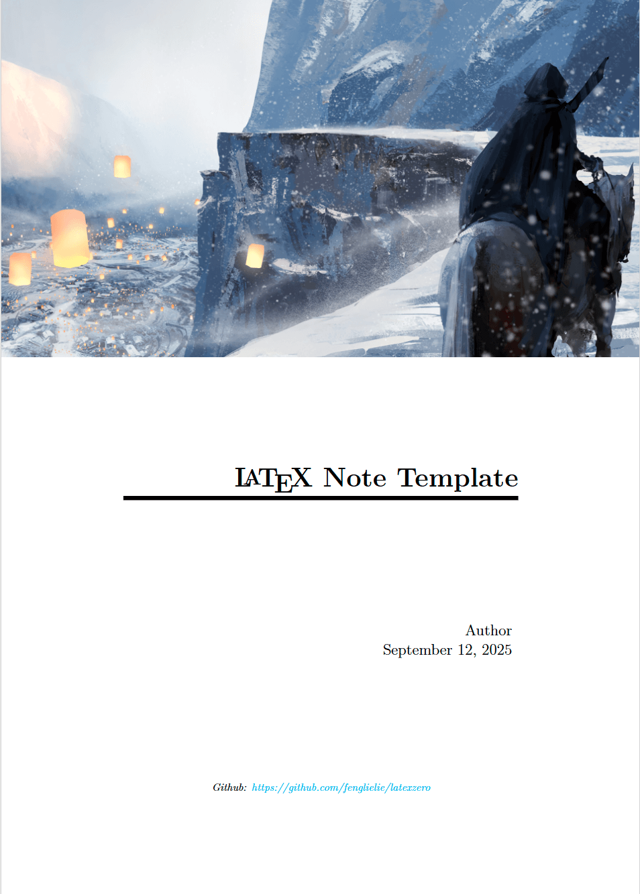
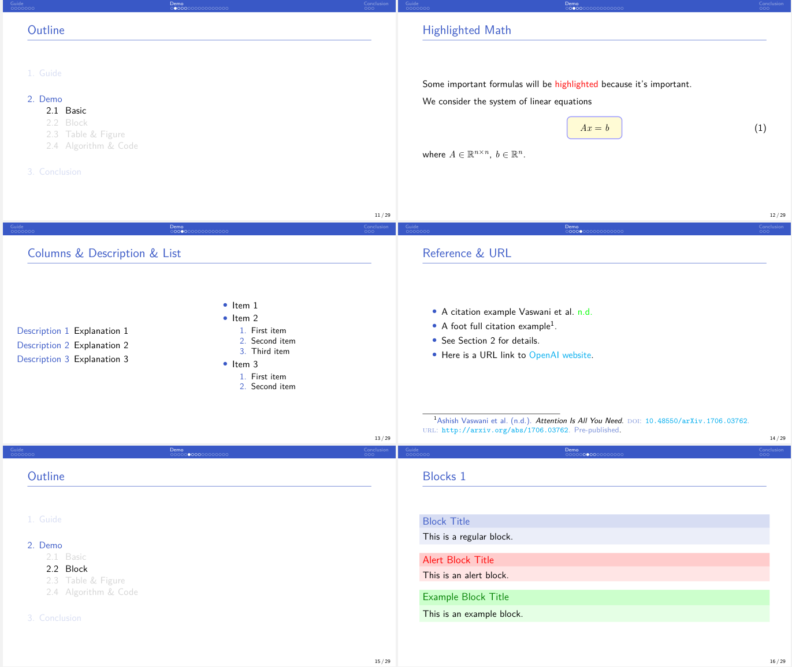
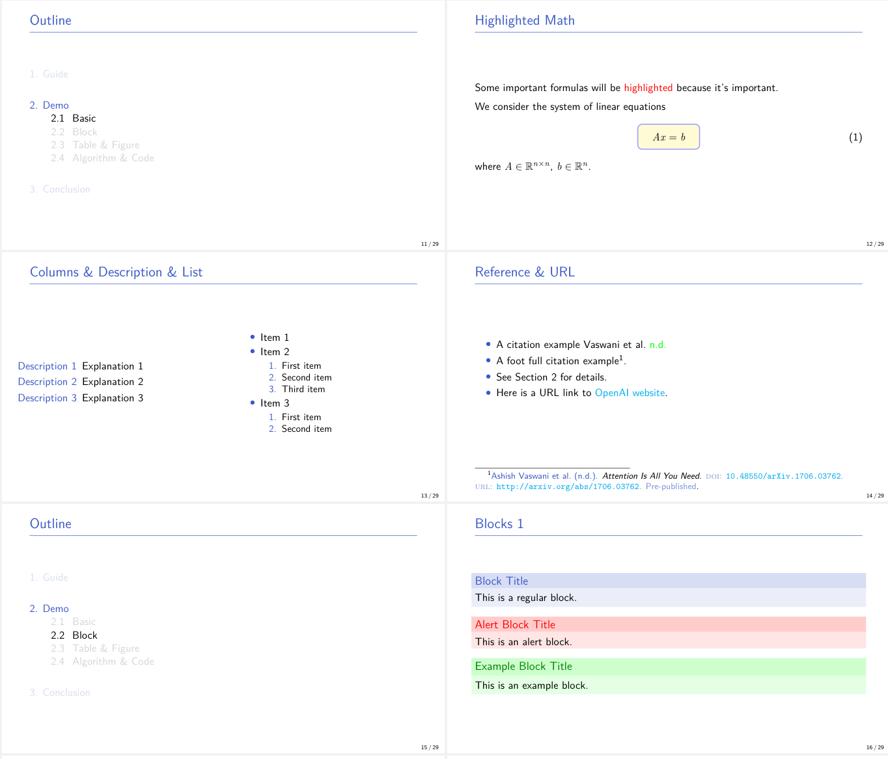
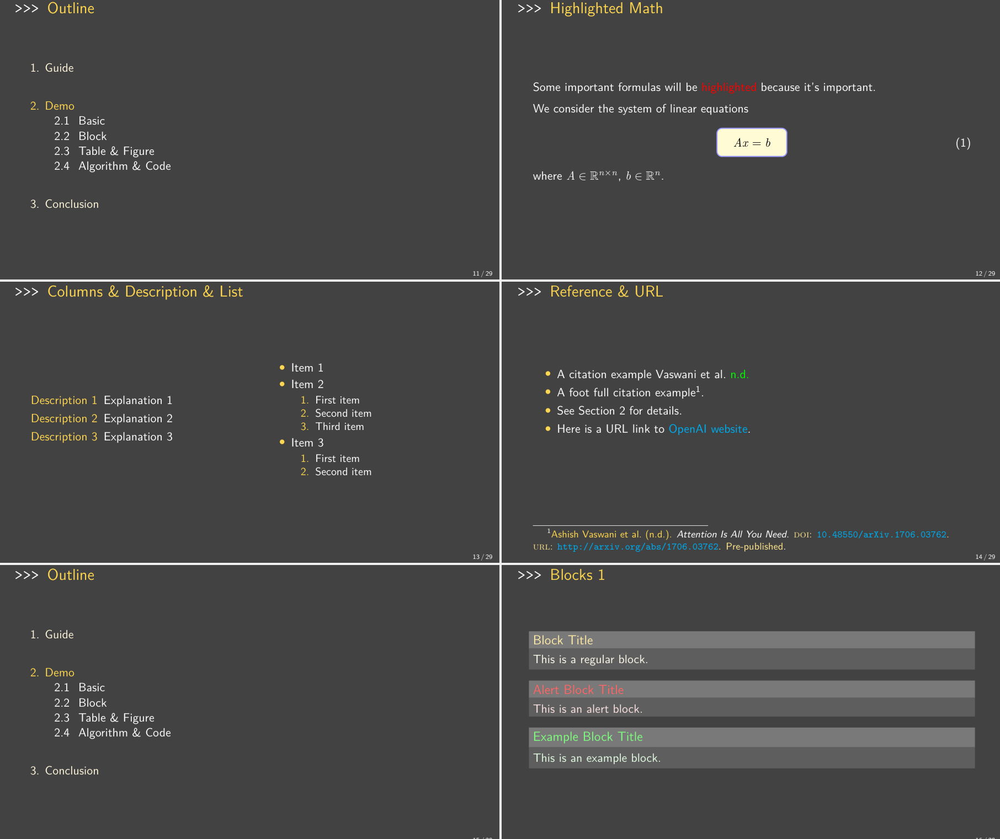

# 数学笔记 LaTeX 模板

[English](./README.md) | 简体中文

适用于数学笔记与 Beamer 的简洁 LaTeX 模板。

> 已在 Overleaf 的 TeX Live 2022、2023 和 2024 环境下测试。

> Github page: https://fenglielie.github.io/latexzero/

## 概览

- 提供数学笔记与 Beamer 模板
- 包含多种笔记和演示风格，并附带预览图
- 适用于 Overleaf 和本地 TeX Live 工作流

## 目录

- [数学笔记 LaTeX 模板](#数学笔记-latex-模板)
  - [概览](#概览)
  - [目录](#目录)
  - [如何使用？](#如何使用)
  - [Note](#note)
    - [可用样式](#可用样式)
    - [支持的环境](#支持的环境)
    - [用法](#用法)
    - [封面页](#封面页)
  - [Beamer](#beamer)
    - [可用样式](#可用样式-1)
    - [用法](#用法-1)
  - [补充](#补充)

## 如何使用？

1. 克隆或下载本仓库，或者只下载你需要的文件，例如 [note-setup.tex](./note/note-setup.tex)。

2. 在文档导言区通过 `\input` 引入对应的设置文件。

使用示例：
```latex
\documentclass{article}
\input{./note-setup}

\title{Title}
\author{Author}
\date{\today}

\begin{document}

\maketitle

\end{document}
```


## Note

### 可用样式

这些 note 样式共享同一套命令和环境定义，因此只需替换对应的 setup 文件即可直接切换。

- `note-setup` = `note-setup-box`
- `note-setup-simple`
- `note-setup-box` (tcolorbox)
- `note-setup-leftsidebox` (tcolorbox)
- `note-setup-borderless` (tcolorbox)
- `note-setup-dark` (tcolorbox，实验性样式，实际使用时可能存在一些问题)
- `note-setup-mdframed` (mdframed, legacy)

**note-setup-simple**



**note-setup-box**



**note-setup-leftsidebox**



**note-setup-borderless**



**note-setup-dark**



### 支持的环境

| Environment                   | Style           | Numbering Rule              |
| ----------------------------- | --------------- | --------------------------- |
| `theorem`, `theorem*`         | plain           | within section              |
| `proposition`, `proposition*` | plain           | shares counter with theorem |
| `corollary`, `corollary*`     | plain           | shares counter with theorem |
| `lemma`, `lemma*`             | plain           | shares counter with theorem |
| `claim`, `claim*`             | plain           | shares counter with theorem |
| `definition`, `definition*`   | definition      | within section              |
| `example`, `example*`         | definition      | within section              |
| `problem`, `problem*`         | definition      | within section              |
| `remark`, `remark*`           | remark          | within section              |
| `note`, `note*`               | remark          | within section              |
| `solution`, `solution*`       | (solutionstyle) | within section              |


### 用法
```latex
\documentclass{article}
\input{/path/to/note-setup}

...
```

### 封面页

如需添加封面页，可使用 `\makecover`。




## Beamer

### 可用样式

这些 Beamer 样式共享同一套命令和结构，因此只需替换对应的 setup 文件即可直接切换。

- `beamer-setup`
- `beamer-setup-plain`
- `beamer-setup-console`（灵感来自 [kmbeamer](https://github.com/kmaed/kmbeamer)）

**beamer-setup**



**beamer-setup-plain**



**beamer-setup-console**



### 用法
```latex
\documentclass[compress,aspectratio=169]{beamer}
\input{/path/to/beamer-setup}

...
```

## 补充

- 仓库中还提供了一个位于 [`lab-report/`](./lab-report/) 下的 `lab-report` 模板。
- 仓库中还附带了一份可用的 VS Code LaTeX Workshop 配置，见 [`.vscode/settings.json`](./.vscode/settings.json)。
